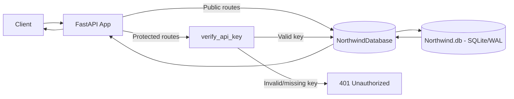
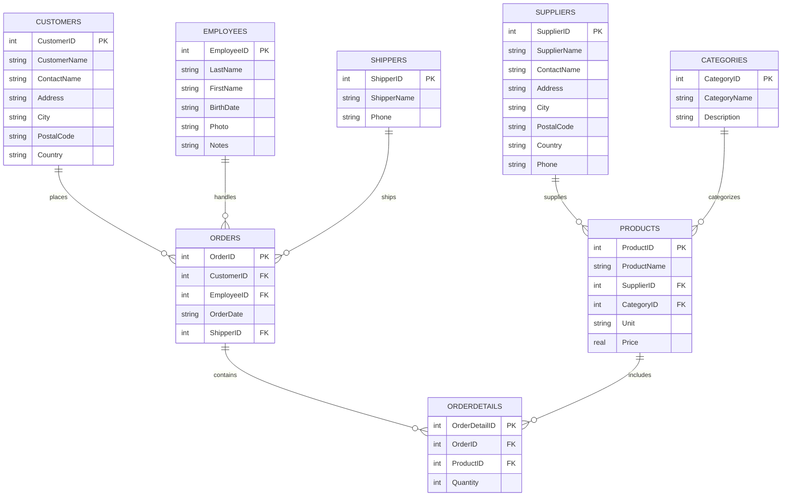
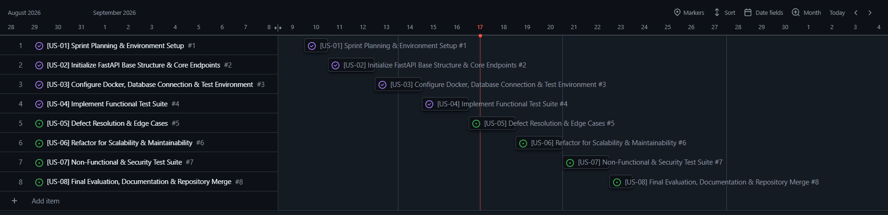
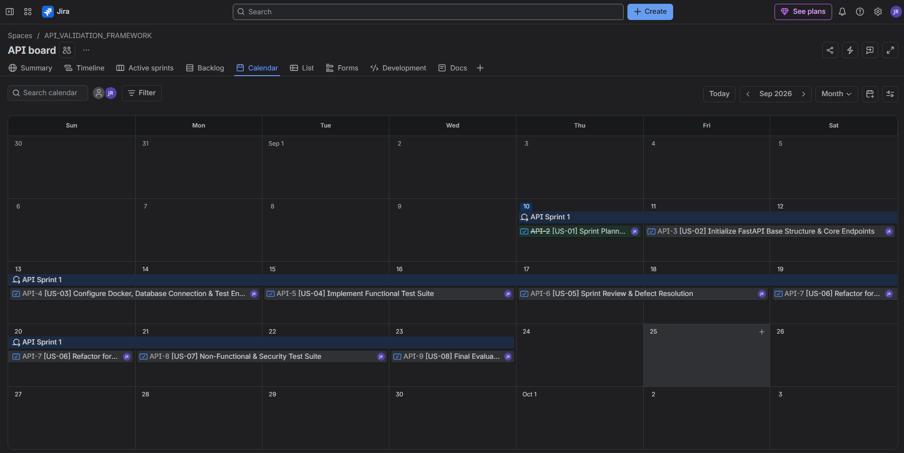
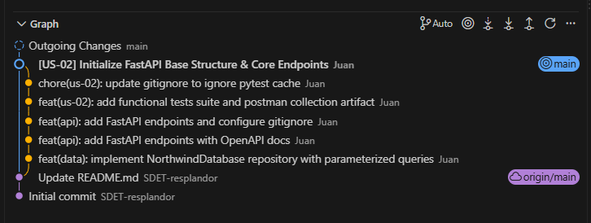

# Northwind Data API

REST API for querying Northwind data, with public and API-key
protected endpoints, built with FastAPI and tested end-to-end with
Pytest, Postman/Newman, and k6.

## Table of Contents
- [Architecture](#architecture)
- [Endpoints](#endpoints)
- [Security](#security)
- [Getting Started](#getting-started)
- [Testing](#testing)
- [CI/CD](#cicd)
- [Development Process](#development-process)
- [Known Limitations](#known-limitations)
- [Tech Stack](#tech-stack)

## Architecture

### Request flow



### Database schema



## Endpoints

### Public (no authentication required)
| Method | Endpoint | Description |
|--------|----------|-------------|
| GET | `/` | Health check |
| GET | `/api/v1/products` | List products, optional `?name=` filter, `?limit=` |
| GET | `/api/v1/products/{id}` | Get a single product |
| GET | `/api/v1/categories/{id}` | Get a single category |
| GET | `/api/v1/suppliers` | List suppliers (ID + name only, no contact info) |

### Protected (requires `X-API-Key` header)
| Method | Endpoint | Description |
|--------|----------|-------------|
| GET | `/api/v1/table/{table_name}` | Generic access to internal tables (employees, shippers, customers, orders, orderdetails), with optional `?id=` and `?name=` filters |

## Security

- **Table whitelist**: the generic `/table/{table_name}` endpoint only accepts a predefined set of tables, preventing access to arbitrary or system tables.
- **Timing-safe API key comparison** (`secrets.compare_digest`) to prevent timing attacks.
- **LIKE-clause escaping** on name filters, preventing wildcard injection (`%`, `_`) from returning unintended broad results.
- **Public vs. protected split**: only non-sensitive resources (products, categories, supplier names) are public; internal tables require authentication.
- **Centralized error handling**: unexpected database errors are logged server-side with full detail, but only a generic message is returned to the client, avoiding leakage of internal implementation details.

## Getting Started

```bash
git clone <repo-url>
cd api-validation-framework
python -m venv venv
venv\Scripts\activate          # Windows
pip install -r requirements.txt
cp .env.example .env           # then set your own API_KEY
uvicorn src.main:app --reload
```

API docs available at `http://localhost:8000/docs`.

## Testing

### Automated suite (Pytest)
43 tests covering happy paths, edge cases, authentication, SQL injection
attempts, response contracts, and mocked failure scenarios.

```bash
pytest -v
```

### Manual/black-box verification (Postman + Newman)
```bash
newman run "collections/Northwind Data API.postman_collection.json" \
  --env-var "baseUrl=http://127.0.0.1:8000" \
  --env-var "apiKey=<your-key>"
```

### Performance testing (k6)
Located in `performance_tests/`.

**Load test** (50 VUs, 30s):
- p(95) response time: 65.62ms
- Error rate: 0.00% (threshold: <5%) ✓
- Throughput: ~48.5 req/s

**Stress test** (ramp up to 300 VUs over 4 stages, ~1m20s):
- p(95) response time: 115.47ms (threshold: <500ms) ✓
- Error rate: 0.00% (threshold: <5%) ✓
- Throughput: ~122 req/s

**Spike test** (sudden jump to 300 VUs, 5 stages):
- p(95) response time: 114.41ms
- Error rate: 0.00%
- Throughput: ~148 req/s
- No degradation observed even under the sudden traffic spike

*Note: tested against SQLite on a single local machine, not
representative of production infrastructure under real network
conditions.*

## CI/CD

GitHub Actions runs on every push to `main`:
1. Lint with Ruff
2. Format check with Ruff
3. Run the full Pytest suite

## Development Process

This project was built following Scrum, with 8 user stories tracked
across a 2-week sprint (Sep 10-23, 2026).





Work was done on a feature branch with granular commits, then
squash-merged into `main` with one descriptive commit per story:



## Known Limitations

- No rate limiting on public endpoints (would use `slowapi` in production).
- Tested against SQLite, not a production-grade database with real concurrency.
- Some deprecation warnings from FastAPI/Starlette's test dependencies
  (`httpx`, `anyio`), unrelated to this project's code.

## Tech Stack

Python 3.14 · FastAPI · Pydantic · SQLite (WAL mode) · Pytest ·
Docker · GitHub Actions · Ruff · Postman/Newman · k6